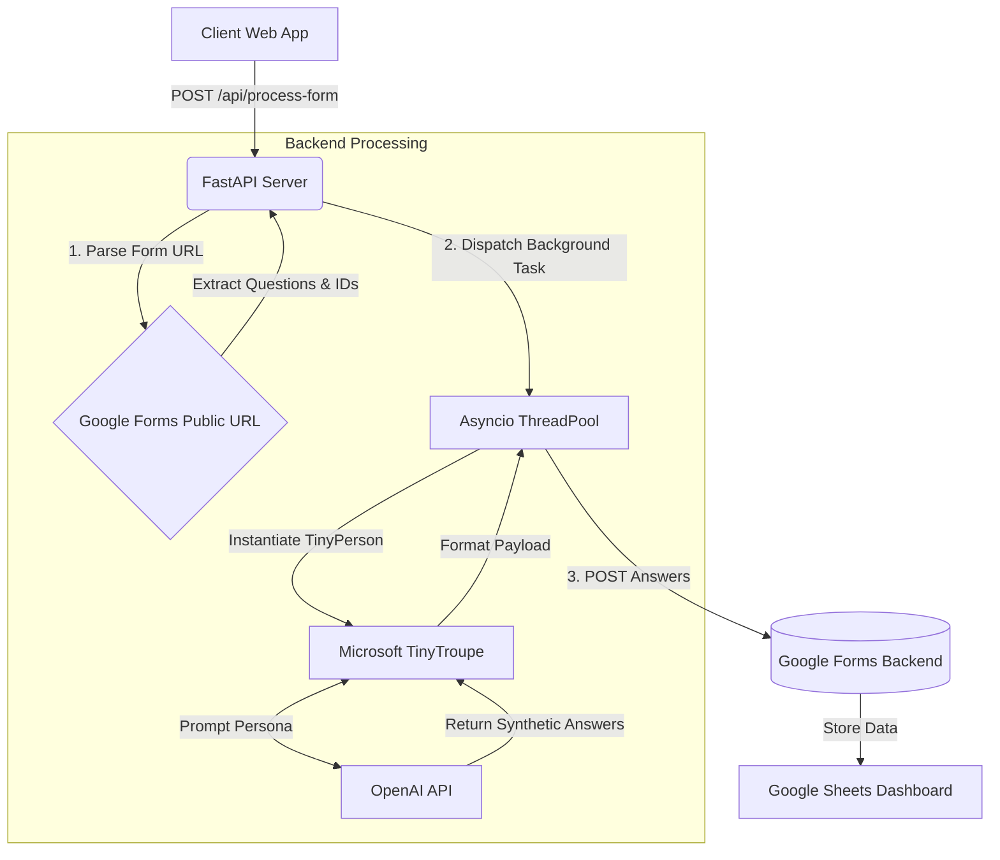

# Final Project: Synthetic Survey Data Generator (TinyTroupe Responder)

**GitHub Repository**: [Insert Your GitHub Repo URL]

## 1. Target Customer

**Who do we want to sell to?**
Our target customers are **Market Researchers, Product Managers, and UX Designers** working in mid-sized product companies or marketing agencies. 

**What job are they trying to do?**
When designing a new survey, researchers need to pilot-test their questions to ensure they are interpreted correctly, and they need dummy data to build and test their downstream data analysis pipelines (dashboards, SQL queries, etc.) before the actual human data rolls in. 

**What is the status quo?**
Currently, researchers either fill out their own surveys manually (which is slow, biased, and lacks diversity) or they pay for small batches of real respondents on platforms like Amazon Mechanical Turk or Prolific. This can cost hundreds of dollars and take several days just for a "dry run."

**Why is our system better?**
Our system allows them to instantly generate diverse, persona-driven responses to their Google Form in seconds. By defining distinct "Persona Groups," they can simulate how different demographics might answer, allowing them to spot confusing questions, populate their dashboards, and validate their survey flow at a fraction of the cost and time of the status quo.

---

## 2. Evidence of Demand and Willingness to Pay

**Evidence of the Problem:**
The need for synthetic data is a rapidly expanding market. Analysis of forums like Reddit's `r/MarketResearch` and `r/UXResearch` frequently shows professionals complaining about the time and cost associated with recruiting pilot testers. Furthermore, the rise of B2B synthetic data startups (e.g., Gretel.ai, Mostly.AI) validates that enterprises are actively seeking ways to generate safe, realistic data without human bottlenecks.

**Willingness to Pay:**
Recruiting a single participant on platforms like Prolific costs a minimum of $8.00/hour, equating to roughly $1.50 per 10-minute survey response. 
Our system could operate on a SaaS subscription model:
- **Basic Tier**: $19/month for up to 1,000 synthetic responses across 5 personas.
- **Pro Tier**: $99/month for up to 10,000 synthetic responses with advanced, multi-agent persona interactions.

Given the time saved in manual data entry and the money saved on pilot testing, a $19/month subscription is highly competitive and represents significant value for a research team.

---

## 3. Go-to-Market Difficulties (Bonus)

- **Trust and Adoption**: The biggest hurdle is convincing researchers that LLM-generated responses accurately simulate human intent. We must carefully position the product as a *survey prototyping and pipeline-testing tool*, rather than a replacement for final, authentic human research.
- **Unit Economics & Data Costs**: Our system relies heavily on OpenAI's API via Microsoft's `tinytroupe`. If a user generates 10,000 responses, our API costs scale linearly. We must carefully price our subscription tiers to ensure profitability per API token.
- **Platform Dependency**: We currently scrape and POST to Google Forms. If Google changes their DOM structure or restricts programmatic POST requests to `formResponse`, our ingestion/delivery pipeline will break. We will need to actively monitor Google's terms of service and adapt.

---

## 4. System Design Expectations

### Data Sources
- **Ingestion**: We ingest live Google Forms by scraping the public `viewform` URL. We use Python's `requests` and Regular Expressions to parse the embedded JSON (`FB_PUBLIC_LOAD_DATA_`), extracting the Form Title, Description, Question Texts, and internal Entry IDs.

### Storage and Processing
- **Processing**: The core processing logic is built on **FastAPI**. To handle bulk submissions efficiently without timing out the client, we utilize asynchronous programming (`asyncio.to_thread`) and FastAPI's `BackgroundTasks`. 
- **LLM Orchestration**: The actual data generation is handled by Microsoft's `tinytroupe` framework. We instantiate unique `TinyPerson` objects for each requested persona, inject an iteration ID to ensure response variability, and prompt the OpenAI models to act as these respondents.
- **Storage**: Rather than building a separate database, we leverage **Google Forms as our storage layer**. We act as a passthrough, transforming the LLM output into form-encoded payloads and HTTP `POST`ing them directly to Google's backend.

### Delivery
- **User Interface**: The customer consumes the product via a sleek, modern Web App (HTML/Vanilla CSS/JavaScript). The UI supports dynamically adding multiple Persona Groups and submission counts. It provides instant visual feedback when the asynchronous background task begins, and the final synthetic data is delivered directly into the user's native Google Form Spreadsheet.

### Architecture Diagram

### Scalability & Cost
Currently, the system uses a single FastAPI instance and limits concurrent submissions to 100 to prevent overwhelming the thread pool. 
- **At 10x Scale (1,000 submissions)**: We would need to replace `BackgroundTasks` with a robust message queue like **RabbitMQ** or **Celery** backed by Redis. This would allow us to distribute the TinyTroupe generation tasks across multiple worker nodes.
- **At 100x Scale (10,000+ submissions)**: We would containerize the application using Docker and deploy it to a managed Kubernetes cluster (e.g., AWS EKS) or use serverless functions (AWS Lambda) specifically for the LLM processing nodes, allowing infinite horizontal scaling based on the queue depth.
